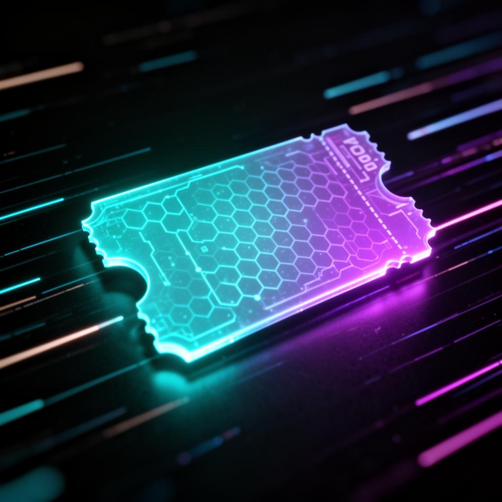

<p align="center">
  
</p>

<h1 align="center">🎟️ NFTicket</h1>

<p align="center">
  <strong>Ingressos NFT para o futuro dos eventos</strong>
</p>

<p align="center">
  
  
  
  
  
  
</p>

---

## 📖 Sobre

**NFTicket** é uma plataforma SaaS Web3 para emissão, venda e revenda de ingressos em formato NFT (ERC-721), garantindo:

- 🔒 **Anti-Fraude** — Cada ingresso é um NFT único e verificável na blockchain
- 🔁 **Revenda Segura** — Marketplace oficial com royalties automáticos para organizadores
- 💼 **Propriedade Real** — O ingresso fica na wallet do usuário, sob seu controle total
- 📱 **Check-in Digital** — QR Code validado on-chain, rápido e sem filas

---

## 🖼️ Screenshots

<p align="center">
  ### Tela Principal


  ### Tela Eventos


  ### Como Funciona


</p>

---

## 🏗️ Arquitetura

```
┌─────────────────────────────────────────────┐
│                  Frontend                    │
│         React + Vite + TailwindCSS           │
│          Framer Motion + shadcn/ui           │
├─────────────────────────────────────────────┤
│              Web3 Integration                │
│           MetaMask + Ethers.js               │
├─────────────────────────────────────────────┤
│               Blockchain                     │
│        Sepolia · ERC-721 · ERC-2981          │
├─────────────────────────────────────────────┤
│              Armazenamento                   │
│          IPFS (Pinata) · Metadata            │
└─────────────────────────────────────────────┘
```

---

## 🔄 Fluxo Principal

| Etapa | Descrição |
|-------|-----------|
| **01** | Empresa cria evento, gera NFTs ERC-721 e salva metadata no IPFS |
| **02** | Cliente conecta wallet, compra o NFT e recebe na carteira |
| **03** | Revenda no marketplace com royalties automáticos via smart contract |
| **04** | QR Code escaneado na entrada, validação on-chain, ingresso marcado como usado |

---

## 👥 Perfis de Usuário

### 👑 Administrador
- Aprovar/rejeitar empresas
- Definir taxas da plataforma
- Métricas e relatórios globais

### 🏢 Empresa (Organizadora)
- Cadastro e gestão de eventos
- Emissão de NFTs (lotes de ingressos)
- Scanner de check-in

### 👤 Cliente
- Login via MetaMask
- Compra e revenda de ingressos
- Visualização de NFTs e QR Code

---

## 🚀 Como Rodar

```bash
# Clone o repositório
git clone https://github.com/seu-usuario/nfticket.git
cd nfticket

# Instale as dependências
npm install

# Rode o servidor de desenvolvimento
npm run dev
```

Acesse `http://localhost:5173` no navegador.

---

## 🛠️ Tech Stack

| Tecnologia | Uso |
|------------|-----|
| **React 18** | Interface do usuário |
| **TypeScript 5** | Tipagem estática |
| **Vite 5** | Build tool |
| **Tailwind CSS 3** | Estilização |
| **shadcn/ui** | Componentes UI |
| **Framer Motion** | Animações |
| **React Router** | Roteamento SPA |
| **MetaMask** | Conexão de wallet |
| **Solidity (ERC-721)** | Smart contracts |
| **IPFS / Pinata** | Armazenamento descentralizado |

---

## 📁 Estrutura de Pastas

```
src/
├── assets/          # Imagens e assets estáticos
├── components/      # Componentes reutilizáveis
│   └── ui/          # shadcn/ui components
├── data/            # Dados mock
├── hooks/           # Custom hooks
├── lib/             # Utilitários
└── pages/           # Páginas da aplicação
    ├── Index.tsx     # Landing page
    ├── Events.tsx    # Listagem de eventos
    ├── EventDetail.tsx
    ├── Marketplace.tsx
    ├── About.tsx
    ├── Contact.tsx
    ├── Terms.tsx
    └── Privacy.tsx
```

---

## 💡 Diferenciais

- 🔒 Ingressos impossíveis de falsificar
- 🔁 Revenda oficial sem cambista
- 💸 Royalties automáticos para organizadores
- 🧾 Histórico completo de propriedade on-chain
- 🎯 Futuro: NFTs colecionáveis, experiências VIP, integração com patrocinadores

---

<p align="center">
  Feito com 💜 por <strong>NFTicket</strong>
</p>
